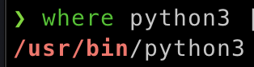

# **Kurs** 

### **Prosess**

Start med å åpne terminalen i home directory'et.
Deretter clone kurs git repository'et.
Så cd inn i den

```bash
git clone https://github.com/specter-0/kurs

cd kurs
```

Nå åpne Vs Code og lag en ny fil som heter *hello*.
Dette skal være en python fil men ikke inkluder .py

*Istedenfor* skal du bruke en 'shebang' linje som forteler terminalen
hvilket 'værktøy' skal brukes til å lese filen.
I dette tilfelle er python 'værktøyet' som skal brukes

Men du kan ikke bare skrive python, du må opgi den fulle pathen til Python.
Du kan finne ut dette ved å skrive følgende i terminalen.

```bash
where python3
```

Eller hvis det ikke funker

```bash
where python
```

Dette vil returnere hvor python er lagret på pcen din.





Du kan så sette den inn i 'shebang' linjen.
Denne linjen legges på toppen av python filen din.

```python
#!/Path-til-python
```

For eksempel

```python
#!/usr/bin/python
```

Hvis flere linjer kommer opp så velger du den korteste.

---

Så legger du inn en print.

```python
print("Hello world")
```

Nå gå tilbake inn i terminalen og skriv.

``` bash
chmod +x ./hellow
```

Denne komandoen gjør *hello* filen om til en executable.
Dette gjør at den kan kjøres fra terminalen som et program
når terminalen leser filen så ser den shebang linjen.
Den vil da interprete koden med python

Du kan nå kjøre filen i terminalen med å skrive

```bash
./hello
```
> ./ betyr directory'et du er i / current directory


Et problem som nå møtes er at du kan bare kjøre filen ved å fortelle om hvor den ligger.
Si du er i home directory'et, indikert ved **~** 

Hvis du vil kjøre filen så må du skrive: *./kurs/hello* .
Eller hvis du er i f.eks desktop: *~/kurs/hello*.
For å la deg kjøre programmet som *ls*, *pwd* eller *where*
så må du legge det til i pathen din

Du kan tenke deg at directories inkludert i pathen.
er på en måte alltid med deg i terminalen, bare usynlig / ved siden av.
selv med ls -la ser du ikke disse filene.

> ls -la er en måte å se hjemte filen som f.eks filer som begynner med .


Vi vil da legge til /kurs i pathen vår.
Da må vi endre config filen til terminalen
denne heter: **.zshrc**.

Eller hvis du ikke bruker iterm: **.bashrc**.

For å redigere disse skriver du enten:

```bash
nano ~/.zshrc
```

Eller hvis du bruken den normale terminalen.

```bash
nano ~/.bashrc
```

Så legg inn denne linjen hvor som helst i filen.

```bash
export PATH="$HOME/kurs:$PATH"
```

Det denne linjen gjør er at du redefinerer PATH variablen.

> PATH er en env: environment variable, envs er variabler som brukes av terminalen for å opperere.
> HOME er også en env som holder hvilken directory home directory'et er og hvordan komme seg ditt.

Den sier: PATH env = vei til home (er oftest /users/brukernavne-ditt) så derfra peker den til kurs.
Så legges resten av pathen bak

> PATH er en liste delt opp med kolon : og ikke komma ,
> Vært element er et directory som du da har tilgang til.
> Dette er hvordan du kan kjøre ting som nano, pwd ls.
> De ligger i directories som blir pekt til via PATH.


Så exit og lagre nano med.

*ctrl + X*

så *Y* for å lagre

deretter *enter*


Du har nå endret config filen men terminalen bruker ennå den gamle.
For å oppdatere må du skrive.

```bash
source ~/.zshrc
```

Eller hvis du bruker den normale terminalen

```bash
source ~/.bashrc
```

For å skjekke om du har gjort riktig så kan du skrive

```bash
env | grep PATH
```
> env returnerer alle envs, | sender output til grep, grep limiterer svarene til bare de som inkluderer PATH.

Starten på strengen bør være lik: PATH=/Users/brukernavn/kurs:

Hvis ikke prøv å redigere config filen på nytt.

Nå kan du kjøre hello fra hvor som helst i terminalen uten å måte si hvor den er

```bash
hello
```

---
## Eksempel på program

I kurs directory'et ligger det en fil som heter tutorial.

Dette er en kommentert eksempelfil for en shell script.
Den er på engelsk fordi idk


Vis du vil se flere eksempler gå til: 


---
Denne koden lager et nytt directory med gitt navn og lager + kjører en python fil inni den
```python
#!/usr/local/bin/python3
import os, sys, subprocess

args = sys.argv[1:] 

if len(args) != 1: 
    print("Tar bare et argument")
    exit(1)

directory_name = args[0] 
os.mkdir(directory_name) 
os.chdir(directory_name) 

with open("main.py", "w") as python_file: 
    python_file.write("print('Hello World')\nexit(0)")

subprocess.run(["python3", "main.py"]) 

exit(0) 
```

Kan kjøres ved å først gjøre den executable med *chmod*
```bash
chmod +x ./tutorial
```

Så for å kjøre
```bash
tutorial
```